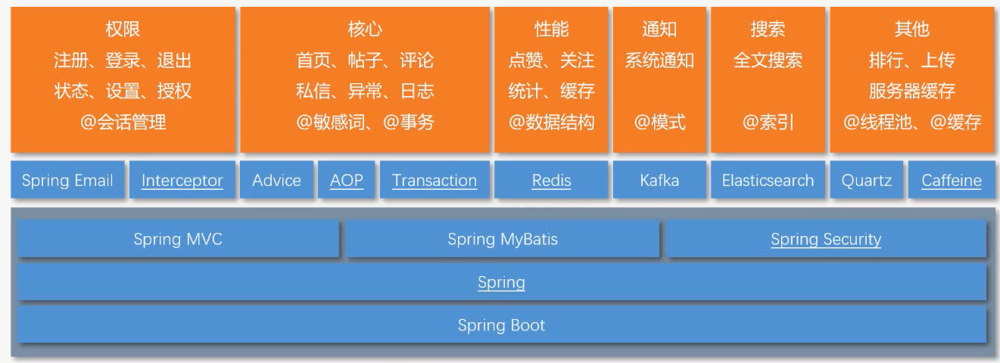
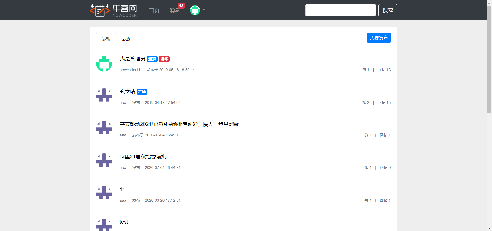

## 介绍

一个仿照牛客网实现的讨论社区。

* 使用 Redis 的 set 实现点赞，zset 实现关注，HyperLogLog 统计 UV(Unique Visitor)，Bitmap 统计 DAU(Daily Active User)
* 使用 Redis 分布式缓存 Caffeine 本地缓存，避免了缓存雪崩
* 并使用 Quartz 定时更新热帖排行
* 使用 Kafka 处理发送评论、点赞和关注等系统通知，并使用事件进行封装，构建异步消息系统
* 使用 Elasticsearch 做全局搜索，并通过事件封装，增加关键词高亮显示等功能

## 环境

- JDK 11
- MySQL 5.7
- Redis 5.0.7
- Elasticsearch 6.4.3
- Kafka 2.3.0

